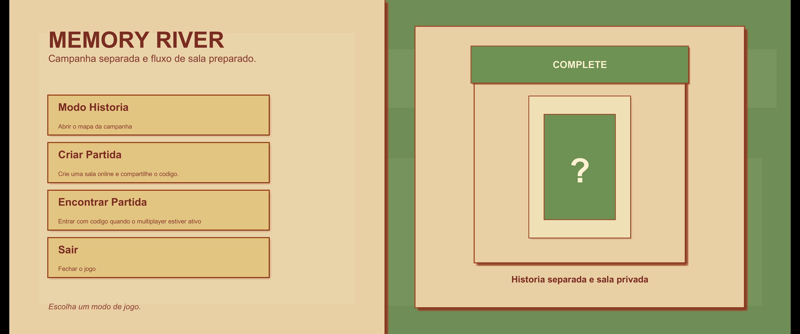
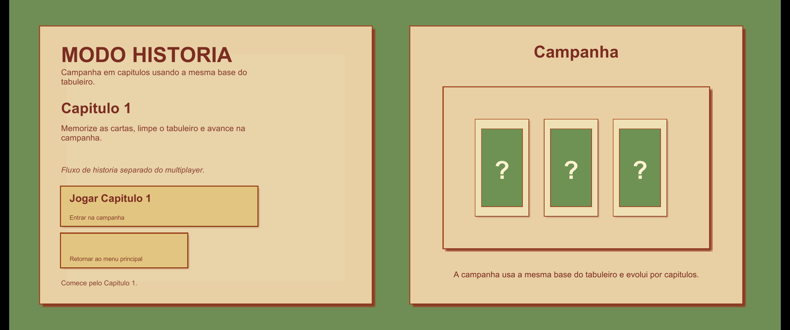
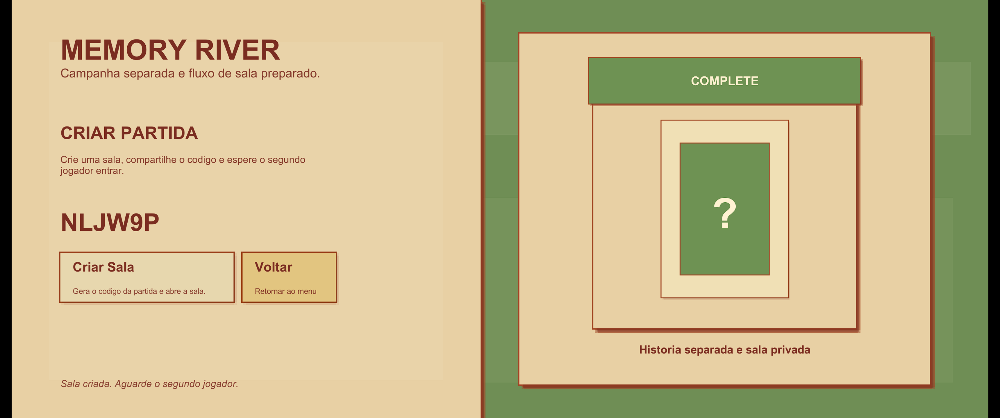
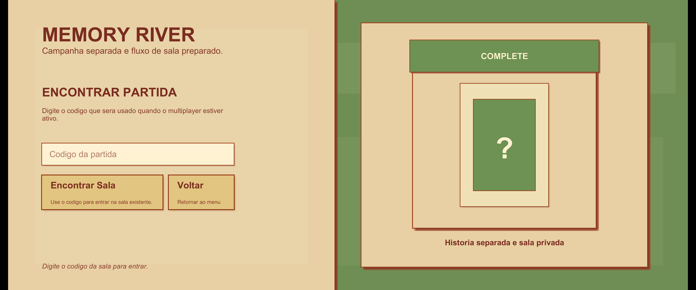
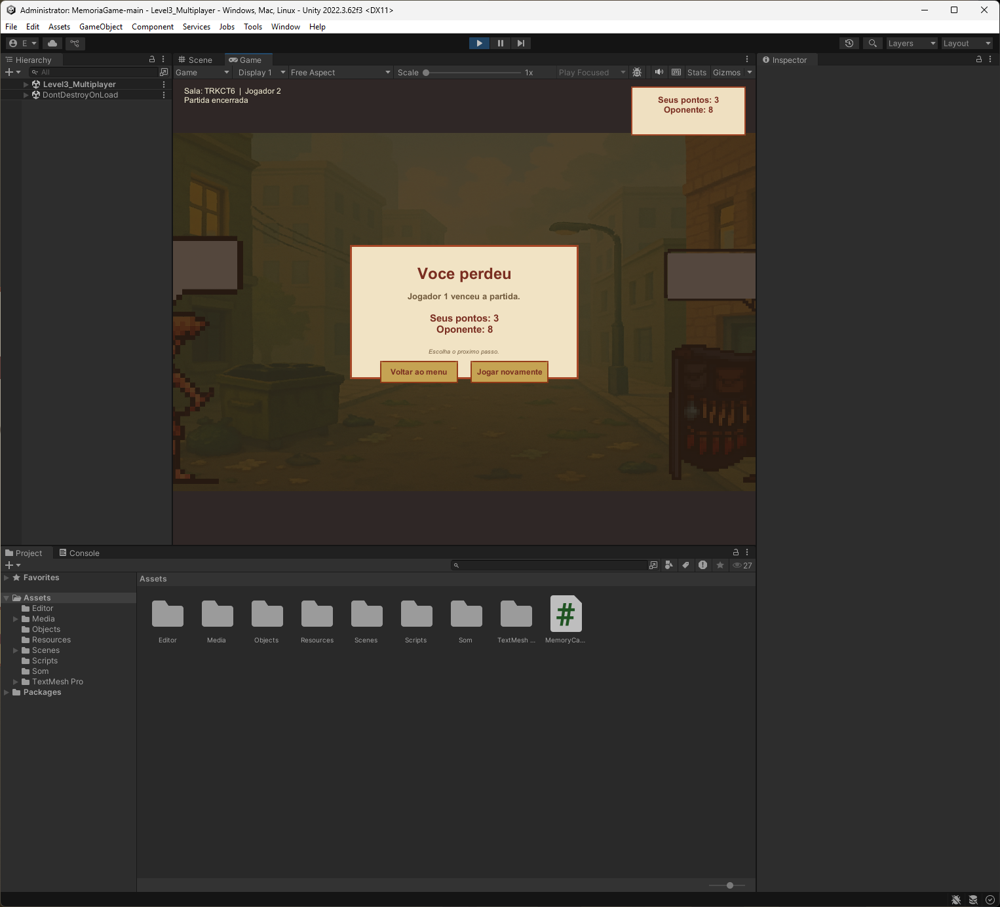

# Memory River

Projeto academico de um jogo da memoria com tema ambiental, desenvolvido em Unity. Este README foi escrito para servir como documentacao tecnica de handoff, ou seja, para permitir que outra pessoa continue o trabalho sem precisar descobrir a estrutura do projeto do zero.

## Midia do Projeto

### Video de demonstracao

O video de demonstracao foi mantido fora do repositorio porque o arquivo original ultrapassa o limite de 100 MB do GitHub.

Sugestao para publicacao:
- subir o video em Google Drive, OneDrive ou YouTube;
- depois substituir esta secao por um link publico.

Descricao:
- video curto de demonstracao do fluxo principal do projeto;
- mostra navegacao entre menus e uma partida em andamento.

### Galeria de telas

As figuras abaixo documentam as telas principais do sistema e servem como referencia visual para continuidade do projeto.

#### Figura 1. Menu principal

Legenda:
- tela inicial do jogo;
- apresenta os fluxos `Modo Historia`, `Criar Partida`, `Encontrar Partida` e `Sair`.

#### Figura 2. Menu do modo historia

Legenda:
- tela intermediaria da campanha;
- permite iniciar o `Capitulo 1` e retornar ao menu principal.

#### Figura 3. Criar partida antes de gerar o codigo

Legenda:
- painel online antes da criacao da sala;
- o codigo ainda nao foi gerado;
- o jogador precisa clicar em `Criar Sala`.

#### Figura 4. Criar partida depois de gerar o codigo

Legenda:
- painel online depois da criacao da sala;
- o codigo de entrada fica visivel para ser compartilhado com o segundo jogador.

#### Figura 5. Encontrar partida

Legenda:
- tela em que o segundo jogador informa o codigo da sala;
- usada para entrar na partida criada pelo host.

#### Figura 6. Gameplay

Legenda:
- tela principal da partida;
- mostra o tabuleiro, os personagens laterais e o estado do jogo durante a rodada.

#### Figura 7. Tela de vitoria

Legenda:
- resultado exibido ao jogador vencedor;
- mostra pontuacao final e botoes de acao.

#### Figura 8. Tela de derrota

Legenda:
- resultado exibido ao jogador derrotado;
- apresenta diferenca de pontuacao e opcoes de continuar ou voltar.

## 1. Visao Geral

O jogo possui dois fluxos principais:

- `Modo Historia`: experiencia local com menu de campanha.
- `Modo Online`: criacao e entrada em partidas usando Unity Relay + Netcode for GameObjects.

No gameplay, o jogador precisa memorizar cartas, formar pares e acumular pontos. No modo online, o host controla o estado da partida e sincroniza as jogadas entre os dois jogadores.

## 2. Objetivo do Projeto

O objetivo deste projeto e unir:

- mecanica de jogo da memoria;
- tema educativo/ecologico;
- menus estruturados para campanha e multiplayer;
- sincronizacao online entre dois jogadores.

## 3. Tecnologias Utilizadas

- `Unity 2022.3.62f3`
- `C#`
- `Unity Netcode for GameObjects 1.5.1`
- `Unity Transport 1.3.4`
- `Unity Services Authentication 2.0.0`
- `Unity Services Relay 1.0.2`
- `TextMeshPro`

## 4. Estrutura Geral do Projeto

Principais pastas:

- `Assets/Scenes`: cenas do jogo
- `Assets/Scripts`: scripts principais de gameplay e menus
- `Assets/Editor`: scripts utilitarios para gerar e corrigir cenas
- `Assets/Media`, `Assets/Objects`, `Assets/Resources`, `Assets/Som`: artes, prefabs, sprites e audio

## 5. Cenas do Projeto

As cenas principais registradas no projeto sao:

### `MainMenu.unity`
Cena inicial do jogo. Possui as opcoes:

- Modo Historia
- Criar Partida
- Encontrar Partida
- Sair

### `StoryMenu.unity`
Cena intermediaria da campanha. Hoje o fluxo esta preparado para o `Capitulo 1`.

### `Level3_Multiplayer.unity`
Cena principal de gameplay. Apesar do nome antigo, ela e usada tanto para:

- modo historia/local
- modo online

## 6. Fluxo de Navegacao

### Fluxo local

`MainMenu -> StoryMenu -> Level3_Multiplayer`

### Fluxo online

`MainMenu -> Criar Partida / Encontrar Partida -> Level3_Multiplayer`

## 7. Explicacao de Cada Classe

Esta e a parte mais importante para continuidade do trabalho.

### `Assets/Scripts/Card.cs`
Responsavel pelo comportamento individual de cada carta.

Funcoes principais:

- armazenar sprite da frente e do verso;
- armazenar valor da carta;
- controlar se a carta ja foi inicializada;
- controlar se a carta ja foi acertada;
- executar animacoes de:
  - aparecer;
  - virar;
  - desaparecer;
- aplicar estados visuais recebidos do modo online.

Observacao:
- A classe nao decide regras da partida. Ela so representa e anima uma carta.

### `Assets/MemoryCardButton.cs`
Componente auxiliar ligado ao clique da carta.

Funcao:

- receber o clique do botao da carta;
- chamar `GameManager.OnCardClicked(cardIndex)`.

Em resumo:
- esta classe faz a ponte entre a interface da carta e a logica do jogo.

### `Assets/Scripts/GameManager.cs`
E o controlador principal do gameplay.

Responsabilidades:

- gerar cartas automaticamente a partir de um prefab;
- montar o tabuleiro;
- iniciar o preview das cartas no inicio da partida;
- controlar cliques locais nas cartas;
- comparar pares;
- tocar sons;
- esconder cartas acertadas;
- controlar score/local HUD;
- criar e atualizar elementos visuais do modo online;
- aplicar snapshots sincronizados vindos do `RelayMatchController`.

Esta e a classe central do jogo durante a partida.

Se alguem for continuar o projeto, esta e uma das primeiras classes que precisa estudar.

### `Assets/Scripts/RelayMatchController.cs`
E a classe central do multiplayer online.

Responsabilidades:

- inicializar Unity Services;
- autenticar jogador;
- criar partida online;
- entrar em partida online usando codigo;
- configurar Relay e transport;
- controlar o `NetworkManager`;
- manter o estado autoritativo do tabuleiro;
- receber pedidos de jogada;
- validar jogadas;
- controlar turno;
- calcular pontos;
- calcular combo de acertos;
- definir vencedor;
- sincronizar estado da partida com os dois jogadores;
- tratar rematch e retorno ao menu.

Resumo:
- no online, essa classe funciona como a autoridade da partida.

### `Assets/Scripts/GameLaunchConfig.cs`
Classe estatica usada para carregar configuracoes de uma cena para outra.

Armazena, por exemplo:

- modo de jogo atual;
- codigo da sala;
- capitulo da campanha;
- mensagens pendentes de status.

E importante porque:
- o menu define o contexto da partida;
- a cena do gameplay le esse contexto depois.

### `Assets/Scripts/MainMenuController.cs`
Controla o menu principal.

Responsabilidades:

- ligar botoes por nome;
- abrir o painel principal;
- abrir painel de criar partida;
- abrir painel de encontrar partida;
- chamar criacao de sala;
- chamar entrada em sala;
- esconder e mostrar informacoes corretas;
- garantir que o codigo da sala so apareca quando deve;
- navegar para modo historia;
- sair do jogo.

### `Assets/Scripts/StoryMenuController.cs`
Controla o menu do modo historia.

Responsabilidades:

- configurar o texto do capitulo;
- ligar botoes `Jogar Capitulo 1` e `Voltar`;
- entrar na cena de gameplay em modo historia.

### `Assets/Scripts/SceneIds.cs`
Classe simples de constantes.

Serve para centralizar os nomes das cenas:

- `MainMenu`
- `StoryMenu`
- `Gameplay`

Vantagem:
- evita erro por string escrita manualmente em varios scripts.

### `Assets/Scripts/MusicPlayer.cs`
Controla a musica persistente entre cenas.

Responsabilidade:

- impedir que varias musicas sejam criadas ao trocar de cena;
- manter uma instancia unica com `DontDestroyOnLoad`.

### `Assets/Scripts/EducationalInfo.cs`
Classe de apoio para textos educativos ou de feedback.

Funcoes:

- mostrar mensagem de sucesso;
- mostrar mensagem de erro;
- esconder mensagem.

Pode ser expandida futuramente para reforcar o tema educativo do jogo.

### `Assets/Editor/MainMenuSceneBuilder.cs`
Script de editor. Nao roda no build final do jogo.

Responsabilidades:

- gerar ou atualizar a cena `MainMenu.unity`;
- montar layout base do menu;
- aplicar estilo visual;
- organizar botoes, paines e decoracao.

Importante:
- serve para reconstruir a cena do menu por codigo.

### `Assets/Editor/StoryMenuSceneBuilder.cs`
Semelhante ao `MainMenuSceneBuilder`, mas focado na cena `StoryMenu`.

Responsabilidades:

- gerar/atualizar a cena `StoryMenu.unity`;
- construir o layout base do menu de campanha;
- organizar paineis, textos e botoes.

### `Assets/Editor/MissingScriptCleaner.cs`
Ferramenta de manutencao do projeto.

Responsabilidades:

- procurar scripts faltando em cenas e prefabs;
- remover referencias quebradas;
- evitar warnings desnecessarios no editor.

Utilidade:
- muito importante depois de migracoes de versao da Unity.

## 8. Como o Online Funciona

Resumo da arquitetura online:

1. Um jogador cria a sala.
2. O projeto gera um codigo de entrada.
3. Outro jogador entra usando esse codigo.
4. O host da partida controla:
   - tabuleiro;
   - turno;
   - pontuacao;
   - vencedor.
5. Os clientes recebem o estado sincronizado.

Isso significa que:

- o modo online e autoritativo;
- a logica principal nao depende de cada cliente localmente tomar decisoes isoladas.

## 9. Estado Atual do Projeto

No momento, o projeto possui:

- menu principal funcional;
- menu de historia funcional;
- gameplay local funcionando;
- gameplay online implementado com Relay/Netcode;
- sistema de pontos;
- sistema de combo de acertos;
- tela final com resultado da partida;
- animacoes de carta.

## 10. O que Outra Pessoa Precisa Saber Para Continuar

Se outra pessoa for continuar o trabalho, a recomendacao e seguir esta ordem:

1. estudar `GameManager.cs`
2. estudar `RelayMatchController.cs`
3. estudar `MainMenuController.cs` e `StoryMenuController.cs`
4. revisar as cenas em `Assets/Scenes`
5. revisar os builders de menu em `Assets/Editor`

### Pontos naturais para evolucao

- melhorar HUD do gameplay;
- melhorar feedback visual de pontos e combos;
- adicionar mais capitulos no modo historia;
- adicionar mais conteudo educativo;
- refinar telas de vitoria/derrota;
- organizar melhor prefabs e assets visuais;
- revisar nomes antigos, como `Level3_Multiplayer`.

## 11. Como Abrir e Executar

### Requisitos

- Unity `2022.3.62f3`

### Passos

1. Abrir o projeto no Unity Hub.
2. Abrir a cena `Assets/Scenes/MainMenu.unity`.
3. Apertar `Play`.

### Para testar o online

1. Abrir dois clientes:
   - Unity Editor + build
   - ou dois builds
2. No cliente 1:
   - `Criar Partida`
   - `Criar Sala`
3. No cliente 2:
   - `Encontrar Partida`
   - digitar o codigo gerado
4. Os dois devem entrar na cena de gameplay.

### Possivel erro ao abrir o build

Se o executavel mostrar erro relacionado a `VCRUNTIME140.dll`, o computador provavelmente esta sem o runtime do Visual C++ necessario para executar o build.

Solucao:

1. Instalar o `Microsoft Visual C++ Redistributable` mais recente.
2. Abrir o jogo novamente.

## 12. Observacoes Importantes

- O projeto passou por migracao de Unity antiga para Unity 2022.
- Existem nomes antigos em algumas cenas e estruturas, mas o fluxo principal atual esta funcional.
- O README foi escrito com foco em continuidade academica, nao em publicacao comercial.

## 13. Resumo Final

Este projeto ja entrega:

- estrutura de menus;
- gameplay de jogo da memoria;
- campanha inicial;
- multiplayer online;
- sincronizacao de estado da partida;
- base para expansao futura.

Para uma continuacao segura do trabalho:

- manter `GameManager` e `RelayMatchController` como referencias centrais;
- documentar novas mudancas conforme forem sendo feitas;
- evitar duplicar logica entre modo historia e modo online.
